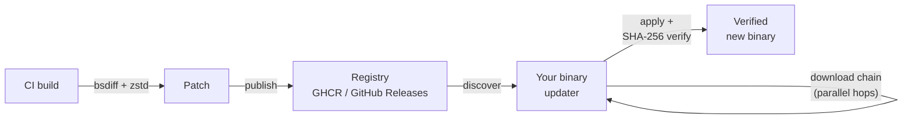

`binpatch` ships a reusable composite GitHub Action for end-to-end
patch generation and publishing. Use it when you want to update an
existing CLI / binary release flow without writing the publish steps
yourself.

## How an update flows



CI produces the patch from the old binary and publishes it to a registry.
Your binary's updater discovers it, downloads the chain in parallel,
applies each hop in order, verifies the cumulative SHA-256, and lands
on the verified new binary.

## What it does

The Action has three modes, mapping 1:1 onto the typical CI job split:

| Mode | What it does |
|------|--------------|
| `generate-ghcr` | Generate per-platform TRDIFF10 patches from a previous nightly, upload them as workflow artifacts |
| `publish-ghcr` | Push generated patches to an OCI registry (typically GHCR) |
| `generate-release` | Generate patches for a stable GitHub Release, upload them as release assets |

Each mode is a single Action call. CI typically wires them together
via `actions/upload-artifact` and `actions/download-artifact` between
the generate and publish jobs.

## Usage

### In your CI workflow

```yaml
jobs:
  generate-patches:
    runs-on: ubuntu-latest
    steps:
      - uses: actions/checkout@v6

      # Download the previous nightly's gzipped binaries from your
      # previous CI run / OCI registry.
      - name: Download previous binaries
        uses: actions/download-artifact@v7
        with:
          name: previous-nightly-binaries
          path: prev/

      # Download the new (just-built) gzipped binaries.
      - name: Upload new binaries
        uses: actions/upload-artifact@v7
        with:
          name: new-binaries
          path: dist-bin/

      - name: Generate delta patches
        id: delta
        uses: BYK/binpatch/action@main
        with:
          mode: generate-ghcr
          version: ${{ needs.build.outputs.version }}
          binaries-dir: dist-bin
          # ... other inputs

      - name: Upload patch artifacts
        if: steps.delta.outputs.has-patches == 'true'
        uses: actions/upload-artifact@v7
        with:
          name: nightly-patches
          path: .delta-patches/
          include-hidden-files: true

  publish-nightly:
    runs-on: ubuntu-latest
    needs: [generate-patches]
    steps:
      - uses: actions/checkout@v6
      - uses: actions/download-artifact@v7
        with:
          name: nightly-patches
          path: .delta-patches/
      - uses: actions/download-artifact@v7
        with:
          name: new-binaries
          path: dist-bin/

      - name: Publish to GHCR
        uses: BYK/binpatch/action@main
        with:
          mode: publish-ghcr
          version: ${{ needs.build.outputs.version }}
          registry: ghcr.io
          repo: ${{ github.repository }}
          binaries-dir: dist-bin
          # ...
```

## Inputs

### Common

| Input | Required | Default | Description |
|-------|----------|---------|-------------|
| `mode` | yes | — | `generate-ghcr`, `publish-ghcr`, or `generate-release` |
| `version` | only for ghcr modes | — | The version tag (e.g. `1.2.3-dev.1784814623`) |
| `repo` | only for ghcr modes | — | OCI repo name (`<owner>/<app>`) |
| `registry` | only for ghcr modes | `ghcr.io` | OCI registry host |
| `binary-glob` | no | `*` | Pattern for the gzipped binary files |
| `new-binaries-dir` | no | `new-binaries` | Directory holding the freshly built UNCOMPRESSED binaries (patch sources and SHA-256 inputs) |
| `new-gz-dir` | no | `new-binaries` | Directory holding the freshly built .gz binaries (used for the size-ratio gate). May be the same as `new-binaries-dir` |
| `binaries-dir` | no | `binaries` | `publish-ghcr`: directory with UNCOMPRESSED binaries for SHA-256 annotation computation |
| `artifacts-dir` | no | `artifacts` | `publish-ghcr`: directory with the .gz binaries to push as registry layers |
| `patches-dir` | no | `patches` | Where patches live (written in `generate-*`, read in `publish-ghcr`). The CI uses `.delta-patches/` (dotted to avoid collision with pnpm `patchedDependencies`); pass that here. |
| `nightly-tag` | no | `nightly` | Mutable nightly tag name |
| `nightly-tag-prefix` | no | `nightly-` | Prefix for versioned nightly tags (e.g. `nightly-1.2.3-dev.1784814623`) |
| `patch-tag-prefix` | no | `patch-` | Patch tag name prefix (e.g. `patch-1.2.3-dev.1784814623`) |
| `artifact-type-prefix` | no | `application/vnd.lore.cli` | OCI artifact type prefix |
| `max-ratio` | no | `50` | Max patch/binary size ratio (percent). Patches larger than this are dropped. |
| `zig-bsdiff-version` | no | `0.1.19` | Pinned bsdiff version to download |
| `zig-bsdiff-sha256` | no | `9f1ac7…b9` | SHA-256 of the pinned bsdiff binary. Verify before bumping. |
| `oras-version` | no | `1.3.1` | Pinned ORAS version to download |
| `oras-sha256` | no | `d52c4a…86` | SHA-256 of the pinned ORAS binary. Verify before bumping. |
| `patch-push-fatal` | no | `false` | When `true`, a failed patch-manifest push aborts `publish-ghcr`. Default is non-fatal (delta upgrades are optional — don't fail the publish job over a transient push error). |

### publish-ghcr

No additional inputs beyond the common table. `patches-dir`,
`nightly-tag`, `nightly-tag-prefix`, `patch-tag-prefix`,
`artifact-type-prefix`, and `patch-push-fatal` are listed there.

### generate-release

| Input | Required | Default | Description |
|-------|----------|---------|-------------|
| `github-repo` | no | `${{ github.repository }}` | `<owner>/<repo>` for the GitHub Releases API |
| `github-token` | yes | — | Token with `repo` scope |
| `artifacts-dir` | no | `patches` | Where to write release-ready artifacts |

> All other inputs from the common table apply. Inputs not used in
> `generate-release` (e.g. `nightly-tag`, `patch-tag-prefix`) are
> silently ignored.

## Outputs

| Output | Description |
|--------|-------------|
| `has-patches` | `"true"` if at least one patch was generated, else `"false"` |
| `from-version` | The previous version the patches target |

Use `has-patches` to gate downstream steps (e.g. skip publish if
nothing was generated).

## Underlying tools

The Action shells out to:

- **`bsdiff`** — [blackboardsh/zig-bsdiff](https://github.com/blackboardsh/zig-bsdiff),
  pinned version (e.g. `0.1.19`) with SHA-256 verification.
  Produces TRDIFF10 patches via `bsdiff old new patch.patch --use-zstd`.
- **`oras`** — pinned version (e.g. `1.3.1`) with SHA-256 verification.
  Used for OCI manifest fetches and pushes.
- **`gh`** — the GitHub CLI, for release asset download in
  `generate-release` mode.

Each tool is downloaded at runtime with version + SHA-256
verification. Re-pin before upgrading.

## Wiring `version` input

`generate-ghcr` and `publish-ghcr` need a `version` input. If your
previous nightly version is itself stored as an OCI tag
(`nightly-<prevVersion>`), the Action queries the registry for it
automatically:

```
oras repo tags <registry>/<repo> | grep '^nightly-[0-9]' | sort -V
```

`generate-release` mode does **not** need a `version` input — it
queries the GitHub Releases API to find the most recent release and
diffs against it.

## Size budget

The Action enforces a per-patch size budget:

```
patch_size ≤ max-ratio × gz_binary_size
```

Default `max-ratio = 50` (50%). If a patch exceeds this, it's
deleted from the patches directory (and not published). This is a
sanity check — a patch that's larger than half the new binary
probably indicates a complete rebuild and is better shipped as a
full binary.

## The dotted `.delta-patches/` directory

The Action defaults to writing patches to `.delta-patches/` (not
`patches/`). The leading dot prevents collisions with repository
contents: pnpm's `patchedDependencies` directory is conventionally
named `patches/`, and we don't want a stray pnpm patch file
accidentally published as a delta.

If you customize the directory, use a dotted name. Avoid `patches`,
`deltas`, `binpatch`, or any name that a tool might use for
something else.

## Per-binary guard

In `publish-ghcr` mode, the Action only publishes patches that have
a matching binary in `binaries-dir`. A patch for
`myapp-linux-x64.patch` is published only if `myapp-linux-x64.gz`
also exists in `binaries-dir`. Patches without a matching binary
are skipped with a warning.

This is defense-in-depth: even if a stray file somehow lands in
`.delta-patches/`, it won't be published as a delta.

## Next

- [Library integration →](/ci-integration/) — using `binpatch` as a library in your own upgrade pipeline
- [Wire Contract →](/wire-contract/) — the file format
